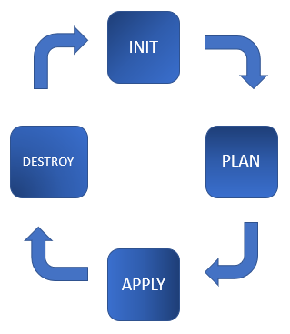
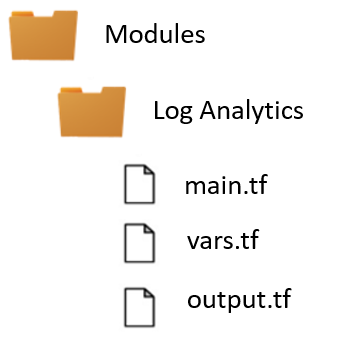

# Azure + GitHub + Terraform:

## Challenge 4 – Terraform: Infrastructure as Code - Part II

[Back](/Hack/challenge03.md) - [Home](README.md) - [Next](/Hack/challenge05.md)

## Terraform workflows and commands

The workflows of Terraform are built on top of four key steps: Init, Plan, Apply, and Destroy.



- ### Terraform init
  Initializes the current working directory.
- ### Terraform plan
  Execution plan to validate against existing environment.
- ### Terraform apply
  Deploys and updates resources.
- ### Terraform destroy
  Removes all resources defined in a configuration.

## Working with Terraform Modules

The definition of Module on Terraform is simple, any set of Terraform configuration files in a folder is a **module**.
A module is a container for multiple resources that are used together.
Every Terraform configuration has at least **one module**, known as its **root module**, which consists of the resources defined in the .tf files in the main working directory.

Modules only have one required attribute: the module`s **sources**. The source tells Terraform where to find the module source codes.

A module can call other modules, which lets you include the child module's resources into the configuration in a concise way. Modules can also be called multiple times, either within the same configuration or in separate configurations, allowing resource configurations to be packaged and re-used.

Learn more in:

- [Terraform Modules](https://learn.hashicorp.com/tutorials/terraform/module)

## Directory Structure:



#### Log Analytics Module Example

### main.tf:

```
resource "azurerm_log_analytics_workspace" "mshack" {
  name                = "${var.name}-logs"
  location            = var.location
  resource_group_name = var.resource_group_name
  sku                 = var.sku
  retention_in_days   = var.retention_in_days

  tags = var.tags
}


resource "azurerm_log_analytics_solution" "mshack" {
  count                 = length(var.solutions)
  solution_name         = var.solutions[count.index].solution_name
  location              = var.location
  resource_group_name   = var.resource_group_name
  workspace_resource_id = azurerm_log_analytics_workspace.mshack.id
  workspace_name        = azurerm_log_analytics_workspace.mshack.name

  plan {
    publisher = var.solutions[count.index].publisher
    product   = var.solutions[count.index].product
  }

  tags = var.tags
}

```

### variable.tf:

```
variable name {}
variable resource_group_name {}
variable location {}
variable sku {}
variable retention_in_days {}
variable tags {}
variable solutions {
  type        = list(object({ solution_name = string, publisher = string, product = string }))
  default     = []
}

```

### outputs.tf:

```
output "resource_id" {
  description = "Id of Log Analytics resource in Azure."
  value       = azurerm_log_analytics_workspace.mshack.id
}

output "workspace_id" {
  description = "Log Analytics Workspace id, this is just a guid."
  value       = azurerm_log_analytics_workspace.mshack.workspace_id
}

```

- [Log analytics Azurerm Documentation](https://registry.terraform.io/providers/hashicorp/azurerm/latest/docs/resources/log_analytics_workspace)

## Calling Child Module in the Root Module

To call a module means to include the contents of that module into the configuration with specific values for its input variables. Modules are called from within other modules using module blocks:

A module that includes a module block like this is the calling module of the child module.

Learn more in:

- [Terraform Child Modules](https://www.terraform.io/docs/language/modules/syntax.html#calling-a-child-module)

Examples:

### main.tf:

```
//Backend Example.
terraform {
  backend "azurerm" {
    resource_group_name  = "terraform"
    storage_account_name = "hackterraform"
    container_name       = "tfstate"
    key                  = "prod.terraform.tfstate"
  }
  required_providers {
    azurerm = {
      version = "~> 2.19"
    }
  }
}

//Provider example
provider "azurerm" {
  features {}
}

//RG
module "RGroups" {
  source = "./Modules/RGroups"
  tupla_rgname_lc = var.tupla_rgname_lc
}

//Log Analytics
module "LogAnalitycs" {
  source                = "./Modules/LogAnalitycs"
  name                  = "mshack"
  depends_on            = [module.RGroups] // Dependencia Explicita.
  resource_group_name   = join("," , module.RGroups.name[*].RGEU2001.name) // Dependencia implicita
  location              = join("," , module.RGroups.name[*].RGEU2001.location) // Dependencia implicita
  sku                   = "Free"
  retention_in_days     = 7
  tags = merge(local.common_tags, local.extra_tags)
  solutions = [
        {
            solution_name = "AzureActivity",
            publisher = "Microsoft",
            product = "OMSGallery/AzureActivity",
        },
    ]
}

```

### Challenge

## Begin programming

1. Create modules of Azure SQL Server, App Services, Log Analitics.

### Success Criteria

1. You should have created modules of Azure SQL Server, App Services, Log Analytics.

### Parcial Solution

---

> [Here](CH03-parcialsolution.md) (Only use if it needed)

---

[Back](/Hack/challenge03.md) - [Home](README.md) - [Next](/Hack/challenge05.md)
