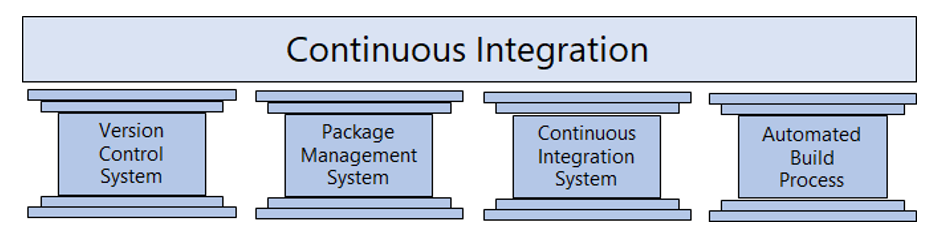

# Azure + GitHub + Terraform:

## Challenge 5 – GitHub: Continuous Integration

[Back](/Hack/challenge04.md) - [Home](README.md) - [Next](/Hack/challenge06.md)

### Introduction

Great, we now have some infrastructure code, lets build it. In DevOps we automate this process using something called Continuous Integration. Take a moment to review the article below to gain a better understanding of what CI is.

1. [What is Continuous Integration?](https://docs.microsoft.com/en-us/azure/devops/learn/what-is-continuous-integration)
2. [Introduction to Continuous Integration](https://www.youtube.com/watch?v=xSv_m3KhUO8)

The Four Pillars of Continuous Integration:

- A Version Control System manages changes to your source code over time.
- A Package Management System is used to install, update and manage software packages and theirs dependencies between them.
- A Continuous Integration pipeline compiles and/or validates the code commited to the principal branch (e.g: main) everytime a change is merged to it.
- An Automated Build Process creates a software build including compiling, packaging, and running automated tests.

Benefits of Continuous Integration:

- Improving code quality based on rapid feedback
- Triggering automated testing for every code change
- Reducing build times for rapid feedback and early detection of problems (risk reduction)
- Better management of technical debt and code analysis
- Reducing long, difficult, and bug-inducing merges
- Increasing confidence in codebase health long before production deployment
- Rapid feedback to the developer

1. How to use GitHub Actions:

   > [GitHub Actions](https://docs.github.com/en/actions/learn-github-actions)

   > [YAML schema reference](https://docs.github.com/en/actions/using-workflows/workflow-syntax-for-github-actions)

2. [Quickstart](https://docs.github.com/en/actions/quickstart)

### Discussion

> Have you tried to implement continuous integration in your organization?

> > If you where successful, what lessons did you learn?

> > If you were not successful, what were the challenges?

### Challenge

In GitHub we use Actions to automate our build process.

1. Go to Actions, then click on "New Workflow", look for Terraform template and click 'Configure button'.
2. Look for the green button named "Start Commit" and click it
3. Type a name for the commit
4. Finally, click the green button named "Commit new file" and you are done.

### Success Criteria

1. Your builds should complete without any errors.
1. You should have a build for the infrastructure.

[Back](/Hack/challenge04.md) - [Home](README.md) - [Next](/Hack/challenge06.md)
