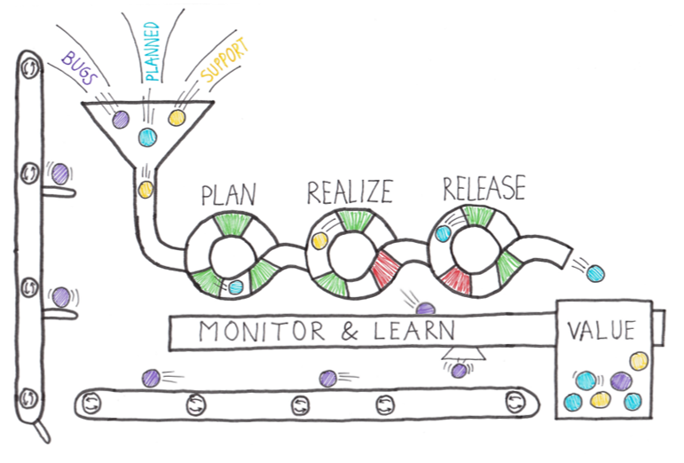

# Azure + GitHub + Terraform:

## Challenge 6 – GitHub Actions: Continuous Delivery

[Back](/Hack/challenge05.md) - [Home](readme.md) - [Next](/Hack/challenge07.md)

### Introduction

---

> "Continuous Delivery is a software development discipline where you build software in such a way that the software can be released to production at any time".
>
> > “ by Martin Fowler”

---

In DevOps after we automate our build process, we want to automate our release process, we do this with a technique called Continuous Delivery. Please take a moment to review this brief article talking about why this is important.

1. [What is Continuous Delivery?](https://docs.microsoft.com/en-us/azure/devops/learn/what-is-continuous-delivery)

Look at the eight principles of Continuous Delivery:

- The process for releasing/deploying software must be repeatable and reliable.
- Automate everything!
- If something is difficult or painful, do it more often.
- Keep everything in source control.
- Done means “released.”
- Build quality in!
- Everybody has responsibility for the release process.
- Improve continuously.

We need to move towards a situation where the value is not piled up and released all at once, but where
value flows through a pipeline. Just like in the picture, a piece of work is a marble. And only one piece of
work can flow through the pipeline at once. So work has to be prioritized in the right way. As you can see
the pipeline has green and red outlets. These are the feedback loops or quality gates that we want to
have in place.

2. [How do GH Actions work?](https://docs.github.com/en/actions/learn-github-actions/understanding-github-actions)

3.[How do I use a GH Action?](https://docs.github.com/en/actions/guides)

You start using GitHub Actions by authoring a workflow (aka pipeline) for your application. To author a workflow, you must specify the artifacts that make up the application and the actions needed to deploy those.
An artifact is a deployable component of your application. It is typically produced through a Continuous Integration or a build pipeline.

You define the release using runners, jobs, and actions.
You define the automation in each event using jobs and actions. You use variables to generalize your automation and triggers to control when the deployments should be kicked off automatically.

### Challenge

In GitHub Actions we use a workflow to release our infrastructure and application. In this challenge we will deploy our infrastructure and apps out the target Azure Subscription.

1. Create a new Action like in the previous challenge.
2. Enable Continuous deployment so that each time the CI pipeline finishes successfully, it starts itself.
3. On the tasks for our `Dev` stage, Add Task to the Agent Job. For Terraform, should you use "Terraform : azurerm" (maybe you need to install previously).
4. For installing Terraform Task, type "terra" in the Search Bar and install the option "Terraform. Install Terraform and run terraform commands to manage resources on Azure, AWS and GCP by Microsoft DevLabs.
5. On the Agent bar, click on the plus symboll and add four tasks, using tthe following order:

- Terraform Installer - (It installs Terraform in the agent machine) [Hint](../Hack/Images/TerraformLatest.PNG)
- Terraform Init - (It is used to initialize a working directory containing Terraform configuration files) [Hint](../Hack/Images/TerraformInit.PNG). There is a section where you have to set up the backend configuration check the example --> [Hint](../Hack/Images/backendconf.PNG)
- Terraform Validate - (This command validates the configuration files in a directory) [Hint](../Hack/Images/TerraformValidate.PNG)
- Terraform Plan - (This command creates an execution plan) [Hint](../Hack/Images/TerraformPlan.PNG)
- Terraform Apply - (This command executes the actions proposed in a Terraform plan) [Hint](../Hack/Images/TerraformApply.PNG)
  **_For Init, Validate, Plan and Apply set up the Configuration Directory point to the Infra-CI Artifact _**

6. Manually start the workflow to deploy the solution.

### Success Criteria

1. You should have all Azure resources deployed, except Front Door.
1. Make a small change in your code, it should automatically trigger a build and release to your `Dev` environment.

[Back](/Hack/challenge05.md) - [Home](readme.md) - [Next](/Hack/challenge07.md)
