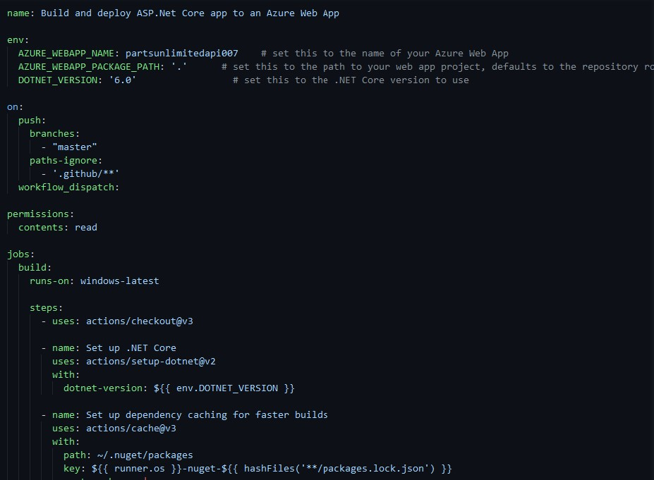
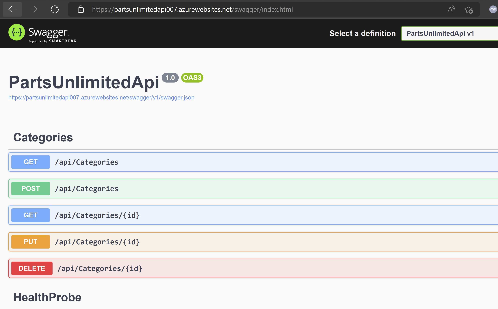

# Azure + GitHub + Terraform:

## Challenge 7 – Build Web App

[Back](/Hack/challenge06.md) - [Home](readme.md) - [Next](/Hack/challenge08.md)

### Introduction

The pupose of any DevOps team is provide value to the end user continuously so to achive that in this exercise we are going to build a CI pipeline (aka workflow) for the web application in this case a Web Api.
The Web Api was developed in ASP .NET Core 6.0 and is a demo rest api that has a health probe in GET api/HealthProbe and Swagger enabled in GET /swagger.
The Web Api connect to a database which database project (PartsUnlimited.Database) that is the same repo.
However, for time constraints we recomend manually deploy the dacpac file to populate the database. [You can use SQL Server Management Studio](https://docs.microsoft.com/en-us/sql/ssms/download-sql-server-management-studio-ssms)

You can create your own api, or even clone the example api from the following link:
[PartsUnlimitedApi](https://github.com/MsftArgHacks/PartsUnlimitedApi)

DO NOT FORGET TO TAKE CARE OF THE Web API CONNECTION STRING ;)

### Challenge

A. Create a CI workflow in GitHub Actions to compile the app so it can be deployed in App Service that will be created using Terraform. 

1. In GitHub menu click 'Actions'.
2. Click in 'New workflow'
3. Search for 'Deploy a .NET Core app to an Azure Web App'.
4. Choose the previous template by clicking the 'Configure' button.
5. In the workflow change the enviroment variable 'DOTNET_VERSION: x' to 'DOTNET_VERSION: '6.0'
6. Modify the enviroment variable 'AZURE_WEBAPP_NAME' to match the name of your App Service. E.G: partsunlimitedapi-team03
7. Click the green button named 'Start commit'.
8. Give the commit a name.
9. Click the green button named 'Commit new file'.
10. Customize the workflow so you can build and deploy the app.
11. Go to Azure portal to download the publish profile of the App Service.
12. Create an Actions Secret with the name "" and copy&paste the XML contained in the publish profile downloaded previously.

At the end your pipeline should look like this:

 

### Success Criteria

1. Run your build and check it completes sucessfully.
2. Check after the build and deploy jobs finishes that you can read the swagger ui browsing the Web Api, hosted in Azure App Service.

[Back](/Hack/challenge06.md) - [Home](readme.md) - [Next](/Hack/challenge08.md)
